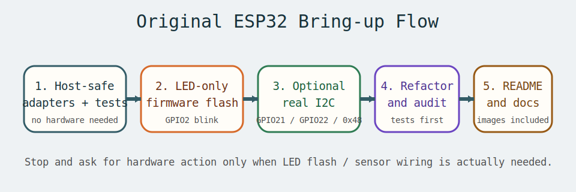
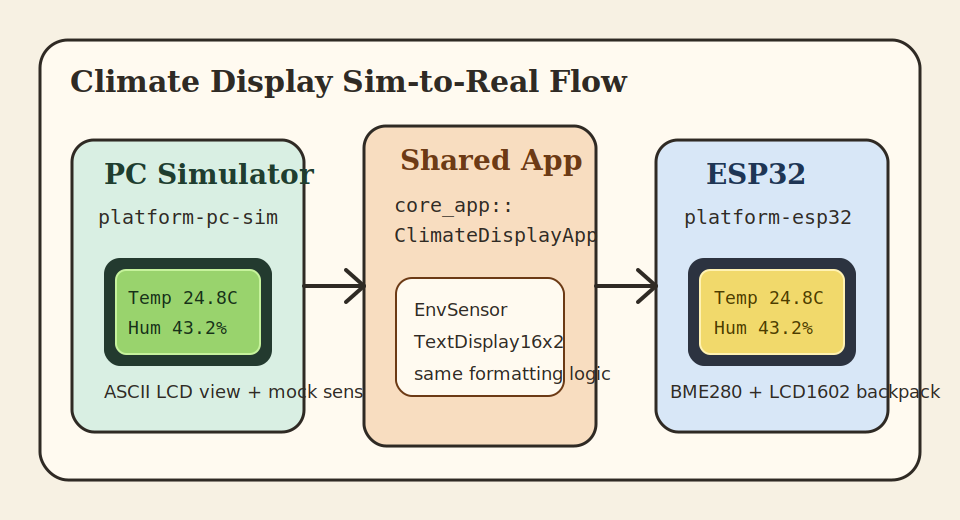

# mcu-hal-sim-rs

[](https://github.com/1222-takeshi/mcu-hal-sim-rs/actions/workflows/ci.yml)

マイコン向けRustアプリケーションを、**ハードウェア抽象化層（HAL）**を通じてプラットフォーム非依存に記述し、PC上のシミュレータで動作確認できるプロジェクトです。

## ✨ 特徴

- **🎯 プラットフォーム非依存**: HAL traitを使用し、同じアプリケーションコードを複数のプラットフォームで実行
- **💻 PCシミュレータ**: 実機なしで開発・デバッグが可能
- **🧪 テスト駆動開発**: 87個のテストでコードの品質を保証
- **🔧 CI/CD自動化**: GitHub Actionsで自動ビルド・テスト・Lint
- **📦 `no_std` 準備**: `hal-api` と `core-app` はホスト依存を持たない構成
- **⚙️ original ESP32 準備**: `platform-esp32` は `embedded-hal` v1.0 経由で実機HALを受けられる構成
- **🧰 実機雛形あり**: `firmware/original-esp32-bringup` から LED only / real I2C の両方を試せる
- **🖥️ LCD simulation UI**: `climate-display-sim` で 16x2 表示を terminal 上にそのまま確認できる
- **🌡️ Sim-to-real 経路**: `ClimateDisplayApp` を PC simulator と original ESP32 実機で再利用
- **🎛️ 診断用 board あり**: `firmware/m5stickc-bringup` で M5StickC の Button / PMU / RTC / IMU を切り分け可能
- **🚀 将来の拡張性**: ESP32、Arduino Nano、Raspberry Pi Picoなどへの対応を予定

## 📐 アーキテクチャ

```
┌─────────────────────────────────────────────┐
│          Application Layer                  │
│  ┌────────────────────────────────────┐     │
│  │  core-app                          │     │
│  │  (プラットフォーム非依存ロジック)  │     │
│  └─────────────┬──────────────────────┘     │
└────────────────┼──────────────────────────────┘
                 │ depends on
┌────────────────▼──────────────────────────────┐
│          HAL Trait Layer                      │
│  ┌────────────────────────────────────┐       │
│  │  hal-api                           │       │
│  │  - OutputPin trait (GPIO)          │       │
│  │  - I2cBus trait (I2C)              │       │
│  └────────────────────────────────────┘       │
└────────────────┬──────────────────────────────┘
                 │ implemented by
        ┌────────┴────────┐
        │                 │
┌───────▼──────┐  ┌──────▼────────────────┐
│ PC Simulator │  │ ESP32 (original 準備中) │
│ platform-    │  │ platform-     │
│ pc-sim       │  │ esp32         │
│ - MockPin    │  │ - Esp32Pin    │
│ - MockI2c    │  │ - Esp32I2c    │
└──────────────┘  └───────────────────────┘
```

この基本構造に加えて、`hal-api::sensor::EnvSensor` と `hal-api::display::TextDisplay16x2` を使う
`ClimateDisplayApp` を追加し、PC simulator と original ESP32 実機の両方で同じ表示ロジックを動かせるようにしています。

## 🚀 クイックスタート

### 前提条件

- Rust 1.70以降（[rustup](https://rustup.rs/)でインストール）

### ビルド

```bash
# プロジェクトをクローン
git clone https://github.com/1222-takeshi/mcu-hal-sim-rs.git
cd mcu-hal-sim-rs

# すべてのクレートをビルド
cargo build

# リリースビルド（最適化あり）
cargo build --release
```

### 実行

```bash
# PCシミュレータを実行
cargo run -p platform-pc-sim

# BME280 + LCD1602 の climate display シミュレータを実行
cargo run -p platform-pc-sim --bin climate-display-sim
```

**期待される出力:**
```
=== PC Simulator Started ===
[GPIO] Pin 13 set HIGH
[GPIO] Pin 13 set LOW
[I2C] Read from 0x48: 4 bytes
...
```

Ctrl+Cで終了します。

`climate-display-sim` では terminal 上に次のような 16x2 表示を描画します。

```text
+----------------+
|Temp    24.8C   |
|Hum     43.1%   |
+----------------+
```

### テスト

```bash
# すべてのテストを実行
cargo test --all

# 詳細出力
cargo test --all -- --nocapture

# 特定のクレートのみ
cargo test -p core-app
```

### コード品質チェック

```bash
# すべてのCIチェックをローカルで実行（推奨）
./scripts/ci-local.sh

# 自動修正モード
./scripts/ci-local.sh --fix

# 個別チェック
cargo fmt --all -- --check            # フォーマットチェック
cargo clippy --all --all-targets -- -D warnings  # Lintチェック
cargo check -p hal-api --lib --target thumbv6m-none-eabi
cargo check -p core-app --lib --target thumbv6m-none-eabi
cargo check -p platform-esp32 --lib --target thumbv6m-none-eabi
cargo check-esp32
```

### original ESP32 実機向けの最小確認

`platform-esp32` は original Xtensa-based ESP32 を対象に進めています。

```bash
# 1. Xtensa 向け toolchain をセットアップ
#    https://docs.espressif.com/projects/rust/book/

# 2. 実機向けチェック
cargo check-esp32
```

詳細は [crates/platform-esp32/README.md](./crates/platform-esp32/README.md) を参照してください。

### original ESP32 bring-up




実機 bring-up は [firmware/original-esp32-bringup/README.md](./firmware/original-esp32-bringup/README.md) から始めてください。

```bash
# LED だけ先に確認
cd firmware/original-esp32-bringup
cargo run --release

# 0x48 の I2C デバイスがある場合
cargo run --release --features real-i2c
```

現在の `core-app` は `0x48` に 4-byte read を行うため、I2C を試す場合は `0x48` で応答する 3.3V デバイスが必要です。
実行ホスト OS は native macOS / native Linux / Windows / WSL2 を想定します。
original ESP32 + CP210x bridge では、LED only firmware の flash / boot log まで確認済みです。
WSL2 で `/dev/ttyUSB*` が見えない場合は、WSL で build して Windows 側の `espflash.exe` から `COMx` へ書き込む手順を使ってください。
macOS では Windows の `COMx` ではなくネイティブの serial device path を前提にしてください。

### Climate display の sim-to-real 経路



`core_app::climate_display::ClimateDisplayApp` は、次の 2 経路で共通利用します。

- PC: `platform-pc-sim::climate_sim::{SequenceEnvSensor, TerminalDisplay16x2}`
- original ESP32: `platform-esp32::{Bme280Sensor, Lcd1602Display, SharedI2cBus}`

実機 firmware は [firmware/original-esp32-climate-display/README.md](./firmware/original-esp32-climate-display/README.md) を参照してください。

```bash
cd firmware/original-esp32-climate-display

# 型検査
cargo check --release

# toolchain / linker が揃っていれば flash まで
cargo run --release
```

### M5StickC を診断用 board として使う

M5StickC は `core-app` の本番実行先というより、ESP32 系 board の I2C / button / USB 接続を
最短で切り分けるための診断用として位置づけています。

```bash
cd firmware/m5stickc-bringup
cargo run --release
```

詳細は [firmware/m5stickc-bringup/README.md](./firmware/m5stickc-bringup/README.md) を参照してください。

この時点での使い分けは次の通りです。

- `cargo run -p platform-pc-sim --bin climate-display-sim`
  - 表示文言、更新周期、16x2 UI を host 上で最初に詰めるとき
- `firmware/original-esp32-bringup`
  - USB / flash / basic GPIO / 汎用 I2C 疎通だけを切り分けたいとき
- `firmware/original-esp32-climate-display`
  - `BME280 + LCD1602` の本命経路を original ESP32 で確認したいとき
- `firmware/m5stickc-bringup`
  - M5StickC を第2の診断ボードとして使い、Button / onboard I2C デバイスを確認したいとき

`M5StickC` は climate display の本命 board ではなく、USB / button / onboard I2C の切り分けを早く回すための補助ボードとして位置付けています。

### CI結果の自動監視

PRをプッシュした後、CIの完了を自動で監視:

```bash
# 最新のワークフローを監視
./scripts/ci-wait.sh

# 特定のrun-idを監視
./scripts/ci-wait.sh 21797882688
```

## 📦 プロジェクト構成

```
mcu-hal-sim-rs/
├── crates/
│   ├── hal-api/          # HAL trait定義
│   │   ├── display.rs    # 16x2 表示 trait
│   │   ├── error.rs      # エラー型（GPIO / I2C / sensor / display）
│   │   ├── gpio.rs       # GPIO trait（OutputPin, InputPin）
│   │   ├── i2c.rs        # I2C trait（I2cBus）
│   │   ├── sensor.rs     # 環境センサ trait
│   │   └── lib.rs
│   │
│   ├── core-app/         # アプリケーションロジック
│   │   ├── climate_display.rs  # ClimateDisplayApp
│   │   └── lib.rs              # App<PIN, I2C>構造体
│   │                           #   - 100 tickごとにLED点滅
│   │                           #   - 500 tickごとにI2C読み取り
│   │
│   ├── platform-pc-sim/  # PCシミュレータ
│   │   ├── climate_sim.rs         # SequenceEnvSensor / TerminalDisplay16x2
│   │   ├── climate_display_sim.rs # 16x2 terminal demo
│   │   ├── lib.rs                 # モックHAL公開
│   │   ├── main.rs                # エントリポイント（10ms tickループ）
│   │   └── mock_hal.rs            # モックHAL実装
│
│   └── platform-esp32/   # original ESP32向けアダプタ
│       ├── bme280.rs       # BME280 sensor driver
│       ├── gpio.rs         # Esp32OutputPin / Esp32InputPin
│       ├── i2c.rs          # Esp32I2c
│       ├── lcd1602.rs      # LCD1602 backpack driver
│       ├── shared_i2c.rs   # 共有 I2C バス
│       ├── lib.rs
│       └── README.md
│
├── docs/
│   └── images/                # 配線図 / bring-up フロー図
│
├── .github/
│   └── workflows/
│       └── ci.yml        # CI/CD設定
│
├── .cargo/
│   └── config.toml       # original ESP32向け cargo alias / runner
│
├── firmware/
│   ├── original-esp32-bringup/
│   │   ├── .cargo/config.toml  # xtensa target / espflash runner
│   │   ├── src/main.rs         # LED only / real I2C bring-up
│   │   ├── Cargo.toml
│   │   ├── README.md
│   │   └── rust-toolchain.toml
│   ├── m5stickc-bringup/
│   │   ├── .cargo/config.toml  # xtensa target / espflash runner
│   │   ├── src/main.rs         # Button / onboard I2C diagnostics
│   │   ├── Cargo.toml
│   │   ├── README.md
│   │   └── rust-toolchain.toml
│   └── original-esp32-climate-display/
│       ├── .cargo/config.toml  # xtensa target / espflash runner
│       ├── src/main.rs         # BME280 + LCD1602 climate display
│       ├── Cargo.toml
│       ├── README.md
│       └── rust-toolchain.toml
│
├── Cargo.toml            # ワークスペース設定
├── rustfmt.toml          # フォーマット設定
└── README.md             # このファイル
```

### クレートの役割

| クレート | 説明 | 依存関係 |
|---------|------|---------|
| **hal-api** | HAL trait定義（`OutputPin`, `I2cBus`, `EnvSensor`, `TextDisplay16x2` など） | なし |
| **core-app** | プラットフォーム非依存のアプリケーションロジック（`App`, `ClimateDisplayApp`） | `hal-api` |
| **platform-pc-sim** | PCシミュレータ実装（モックHAL + 16x2 terminal simulator） | `hal-api`, `core-app` |
| **platform-esp32** | original ESP32向け `embedded-hal` アダプタ + BME280/LCD1602 ドライバ | `hal-api`, `embedded-hal` |

### 実機用テンプレート

| ディレクトリ | 説明 | 依存関係 |
|-------------|------|---------|
| **firmware/original-esp32-bringup** | original ESP32 向け bring-up 雛形 | `core-app`, `platform-esp32`, `esp-hal` |
| **firmware/m5stickc-bringup** | M5StickC 向け board diagnostics | `platform-esp32`, `esp-hal` |
| **firmware/original-esp32-climate-display** | BME280 + LCD1602 向け climate display firmware | `core-app`, `platform-esp32`, `esp-hal` |

## 🧪 テスト

このプロジェクトはテスト駆動開発（TDD）で構築されています。

| クレート | テストタイプ | テスト数 |
|---------|------------|---------|
| hal-api | ドキュメントテスト | 17個 |
| core-app | ユニット + doc test | 29個 |
| platform-pc-sim | ユニット + 統合 + doc test | 21個 |
| platform-esp32 | ユニット + 統合テスト | 20個 |
| **合計** | | **87個** |

## 🛠️ 開発

### TDD原則

このプロジェクトは以下のTDDサイクルに従います:

1. **🔴 Red**: 失敗するテストを書く
2. **🟢 Green**: テストを通すための最小限の実装
3. **🔵 Refactor**: コードを改善

詳細は `/home/takeshi_miura/workspace/CLAUDE.md` を参照してください。

### コントリビューション

プルリクエストを歓迎します！詳細は [CONTRIBUTING.md](./CONTRIBUTING.md) をご覧ください。

**クイックスタート:**

1. このリポジトリをフォーク
2. 機能ブランチを作成 (`git checkout -b feat/amazing-feature`)
3. **🔴 Red**: テストを先に書く
4. **🟢 Green**: 実装してテストを通す
5. **🔵 Refactor**: コードを改善
6. 変更をコミット (`git commit -m 'feat: add amazing feature'`)
7. `./scripts/gh-workflow.sh push` でブランチをプッシュ
8. `./scripts/gh-workflow.sh pr -B main --fill` でプルリクエストを作成

開発ガイドライン、TDD原則、コーディング規約などの詳細は [CONTRIBUTING.md](./CONTRIBUTING.md) を参照してください。

## 📅 ロードマップ

- [x] **Week 1**: PCシミュレータの完成
- [x] **Week 2**: テスト基盤の整備（57テスト）
- [x] **Week 3**: CI/CD環境の構築
- [x] **Week 4**: ドキュメント充実
- [ ] **Week 5**: 統合テスト・カバレッジ向上（進行中）
- [ ] **Week 6**: no_std対応・ESP32準備
- [ ] **Week 7-8**: ESP32実機対応（オプション）

詳細は [CHANGELOG.md](./CHANGELOG.md) と [開発計画](https://github.com/1222-takeshi/mcu-hal-sim-rs/blob/main/.claude/plans/hazy-drifting-frost.md) を参照してください。

## 📄 ライセンス

このプロジェクトはMITライセンスの下で公開されています。

## 🙏 謝辞

このプロジェクトは、組み込みRustコミュニティの素晴らしい取り組み（特に[embedded-hal](https://github.com/rust-embedded/embedded-hal)）にインスパイアされています。
