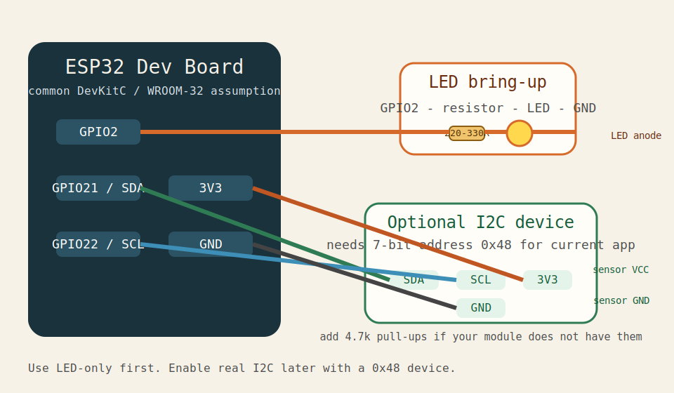

# original-esp32-bringup

original ESP32 向けの最小ファームウェア雛形です。

この crate は workspace 外に置いてあり、ホスト CI には乗せずに実機 bring-up 専用として扱います。
ロジック本体は `core-app` をそのまま使い、GPIO / I2C だけを `platform-esp32` 経由で接続します。
`Cargo.toml` に空の `[workspace]` を持たせているのは、ルート workspace から独立して
`cargo build` / `cargo run` できるようにするためです。



## 前提

- ボード想定: common ESP32 DevKitC / WROOM-32 系
- toolchain: `espup` で導入した `esp` toolchain
- フラッシュ: `espflash`
- 電圧: **3.3V only**
- 想定ホスト OS: native macOS / native Linux / Windows / WSL2
- USB-UART:
  - macOS / Linux では `CP210x` がシリアルデバイスとして見えること
  - Windows では `COMx` として見えること

## 実機で確認済み

- original ESP32 rev `v1.0`
- flash size `4MB`
- `espflash board-info` と LED only firmware flash / boot log
- WSL2 上で build し、Windows 側の `espflash.exe` から `COMx` へ書き込む経路

## 標準手順

ネイティブ Linux / macOS、または WSL からシリアルポートが直接見えている場合はこのままで構いません。

### macOS / Linux での確認の目安

- macOS では `/dev/cu.*` や `/dev/tty.*` に CP210x が見えることを確認してから進める
- Linux では `/dev/ttyUSB*` や `/dev/ttyACM*` を確認してから進める
- どちらも `espflash board-info` が通ることを先に確認すると切り分けが速い

### LED only

```bash
cd firmware/original-esp32-bringup

# LED だけで bring-up
cargo run --release
```

このモードでは GPIO2 の LED 点滅だけを確認し、I2C は no-op です。

### I2C も試す場合

`core-app` は 7-bit address `0x48` に対して 4-byte read を行います。
そのため、I2C bring-up では **0x48 で応答する 3.3V デバイス** を使ってください。

```bash
cd firmware/original-esp32-bringup
cargo run --release --features real-i2c
```

## WSL2 + Windows COM ポートでの実行

WSL2 で `cargo run` しても `/dev/ttyUSB*` が見えない場合は、build だけを WSL で行い、
flash / monitor は Windows 側の `espflash.exe` から実行するのが安定します。

### 1. WSL で ELF を作る

```bash
cd firmware/original-esp32-bringup
cargo build --release

ELF_WIN_PATH="$(wslpath -w "$PWD/target/xtensa-esp32-none-elf/release/original-esp32-bringup")"
echo "$ELF_WIN_PATH"
```

### 2. Windows でボード接続確認

```bash
powershell.exe -NoProfile -Command '& "C:\Users\<you>\Downloads\espflash-win\extracted\espflash.exe" board-info -p COM3 -c esp32'
```

`COM3` は例です。実際の COM 番号に置き換えてください。

### 3. Windows で flash + monitor

```bash
powershell.exe -NoProfile -Command "& 'C:\Users\<you>\Downloads\espflash-win\extracted\espflash.exe' flash -p COM3 -c esp32 -M '$ELF_WIN_PATH'"
```

CP210x ドライバが入っていない場合は、まず Silicon Labs の VCP driver を導入してください。

- CP210x Windows driver: <https://www.silabs.com/documents/public/software/CP210x_Universal_Windows_Driver.zip>
- WSL USB pass-through を使いたい場合: `usbipd-win`

## 配線

### LED only

- `GPIO2` -> `220Ω` から `330Ω` の抵抗 -> LED アノード
- LED カソード -> `GND`

ボードに onboard LED がある場合は、その LED が `GPIO2` に載っていることがあります。
もし違う GPIO に載っている場合は `src/main.rs` の `LED_GPIO` と `peripherals.GPIO2` を合わせて変更してください。

### I2C

- `GPIO21` -> `SDA`
- `GPIO22` -> `SCL`
- `3V3` -> `VCC`
- `GND` -> `GND`
- `SDA` / `SCL` の pull-up がモジュールに無い場合は `4.7kΩ` を `3V3` へ追加

## 補足

- この crate の `.cargo/config.toml` は `xtensa-esp32-none-elf` を default target にしています
- `cargo run` で `espflash flash --monitor` が実行されます
- 初回で詰まりやすいのは toolchain と USB 接続です。USB ケーブルは給電専用でないものを使ってください
- `espflash board-info` が通ることを先に確認すると、flash 失敗の切り分けが速くなります
- WSL2 では COM ポートが Linux 側へ見えないことがあります。その場合は上の Windows 経由手順を使ってください
- macOS を含む native host では、Windows 固有の `COMx` 前提ではなくネイティブの serial device path を使って手順を考えてください
